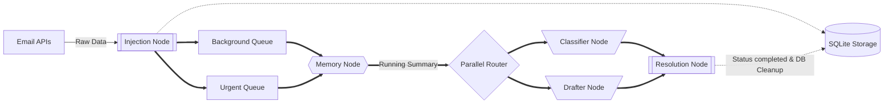
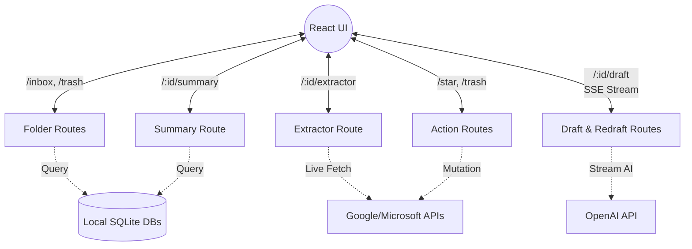
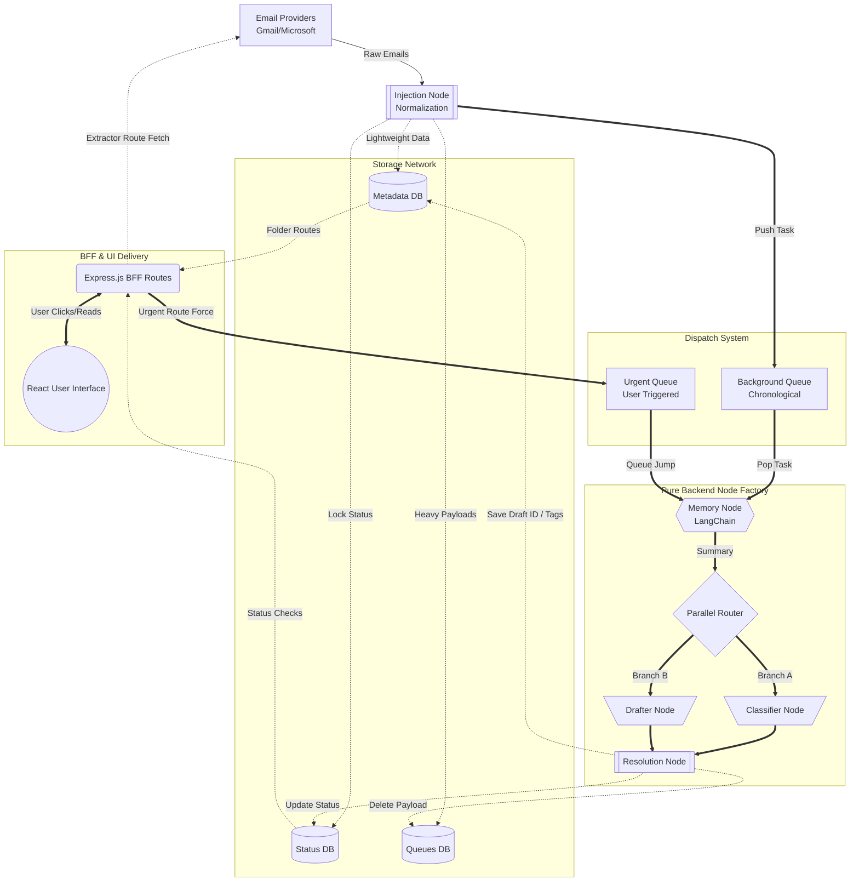

# System Architecture & Build History

This document serves as the definitive overview of the AI Mail Assistant system. The architecture is radically decoupled to guarantee maximum speed, the lowest API costs, and zero UI latency. 

It is divided strictly into three standalone layers: the **Pure Backend**, the **Backend-For-Frontend (BFF)**, and the **React UI**. 

---

## 1. Pure Backend Architecture (The AI Engine)
The Pure Backend is a headless Node.js engine entirely dedicated to pulling emails, managing concurrency queues, and orchestrating OpenAI. It operates strictly node-by-node in a linear assembly line.

### A. The Injection Node (Normalization & Dispatch)
- **What it does:** It intercepts raw data from Google/Microsoft APIs and normalizes it into a Universal Email Object (UEO). 
- **Database Split:** To prevent memory crashes, it splits the data:
  - Writes lightweight display data (sender, subject) to `metadata.db`.
  - Writes the thread status and version lock to `status.db`.
  - Writes the massive HTML payload to `queues.db`.
- **The Dispatch:** It pushes a tiny `{ internal_thread_id, live_version }` packet into either the Background Queue (chronological processing) or the Urgent Queue (if forced by user interaction).

### B. The Memory Node (Compression)
- **What it does:** Standard LLM windows cannot handle 50-email long threads. This node keeps only the `K` most recent messages in raw format. 
- **The Squash:** It takes any message older than `K` and squashes them into a dense, running JSON dictionary stored in `memory.db`. This mathematically guarantees zero context loss while keeping token costs incredibly low.
- **The Counter Logic:** The database tracks a `summarized_count` integer (how many messages are already inside the summary). If a thread has `N` total messages, and we want to keep `K` visible, then exactly `N - K` messages must be inside the summary. If multiple emails arrive in a rapid burst and skip the queue, the node simply slices the array from `summarized_count` to `N - K` and squashes all the "missed" emails into the summary in one single, mathematically perfect LLM call.

### C. The Classifier Node (Tagging & Summaries)
- **What it does:** Running in parallel, this node reads the running summary and the `K` recent messages. It uses a local RAG Vector Database to determine the context of the email against your specific business rules.
- **Output:** It generates a  summary and assigns AI categories (e.g., "Attention", "Work & Professional").
- **Spam Isolation:** If the LLM tags the thread as "Spam", this node intercepts the save process. It forces `is_spam = 1`, removes it from the inbox (`is_inbox = 0`), and strips all other priority categories to keep the UI perfectly clean.
-**Structured_outputs** The llm is forced to give structured outputs so that it can do both task in one LLM call itself, this was done to reduce no of nodes and llm calls required for the creation of the systme

### D. The Drafter Node (Automated Replies)
- **The Gatekeeper Filter:** Before it even touches the AI to draft a reply, the Pure Backend runs a zero-latency JavaScript filter. It completely aborts the draft if:
  1. A draft already exists for this email thread.
  2. The latest sender is the `OWNER_EMAIL` (meaning you already replied manually).
  3. The sender's email address contains automated keywords (e.g., `noreply`, `updates`, `newsletter`, `notifications`, `support`).
- **RAG Generation:** If it passes the filter and a reply is needed, it searches the Vector Database for policies, calendar rules, or pricing, and generates a contextually perfect reply draft, saving the Native Draft ID into the database.
### E. The Resolution Node (Fan-In & Status Sync)
- **What it does:** Because the Classifier and Drafter run in parallel, this node acts as a final barrier, waiting for both AI tasks to finish successfully.
- **Status Flip:** It flips the thread's status from `pending` to `completed` in the `status.db`. This is the exact signal that tells the BFF to unlock the UI for the user.
- **Self-Cleaning:** As the final action, the Pure Backend runs a `DELETE` query to permanently destroy the massive HTML payload from `queues.db`. This ensures the SQLite database stays lightning fast forever and avoids disk bloat.

---

## 2. BFF Architecture (Backend-For-Frontend)
Because the Pure Backend deletes heavy payloads to save space, the React UI relies entirely on the lightweight Express.js BFF to read data. The BFF routes are designed to separate fast local data from heavy remote data.

### A. Folder & Filter Routes
- **Routes:** `/inbox`, `/trash`, `/starred`, `/sent`, `/spam`, `/attention`, etc.
- **What it does:** These routes instantly query the local `metadata.db` and return an array of lightweight email headers. **Zero external API calls are made here**, guaranteeing that switching folders in the UI is visually instantaneous.

### B. The Extractor Route (`GET /:folder/:thread_id/extractor`)
- **What it does:** Triggered when a user clicks an email row to read it.
- **Live Fetching:** Because the Pure Backend deleted the body, the BFF reaches out to Gmail/Microsoft to fetch the massive HTML payload on-the-fly.
- **Preprocessing:** It passes the HTML through `preprocessor.js` to strip tracking pixels and styling, sending only clean text to the React UI.
- **The Queue Jump:** If it detects the thread status is still `pending`, the Extractor route instantly fires a webhook to the Pure Backend's Urgent Queue, forcing the AI to prioritize this specific email immediately.

### C. The Summary Route (`GET /:folder/:thread_id/summary`)
- **What it does:** Instantly queries the `summaries.db` to pull the  AI summary generated by the Classifier Node.

### D. Streaming Draft Routes (`GET /draft` & `POST /redraft`)
- **What it does:** These routes manage Server-Sent Events (SSE) to stream AI text to the UI character-by-character.
- **The Race Condition Handler:** If the UI asks for a draft but the Pure Backend hasn't finished making it yet, the BFF sends a special `[SSE_WAITING]` token. This tells the frontend to show a spinning loading circle while the BFF silently polls the database in the background.
- **Redrafting:** The `POST /redraft` route accepts `user_comments` and the `earlier_draft`, hitting Langchain directly to regenerate the text dynamically based on user instructions.

### E. Action Routes (`POST /star`, `/trash`, `/send`)
- **What it does:** Passes user actions directly to the Google/Microsoft APIs to modify the actual state of the email server. The React frontend uses Optimistic UI updates, so it changes the UI instantly before the BFF even finishes the network request.

### F. Compose & Forwarding Routes
- **What it does:** Dedicated endpoints for generating entirely new AI emails (`/api/compose/draft`) or safely extracting history to attach to a standard forward (`/api/inbox/:id/forward/send`), carefully navigating Google's strict threading requirements.

### G. The BFF Service Layer (The Heavy Lifters)
The Express routes act as traffic cops, but the actual heavy lifting is delegated to dedicated service files:
- **`drafterService.js`:** The core engine for real-time AI streaming. It contains `generateFastCreateStream` (for instant drafts) and `generateRedraftStream` (for user-instructed edits). It manually connects to Langchain, pulls the latest `running_summary` from SQLite, performs a local Vector similarity search (using a custom Cosine Similarity dot-product math function) to find RAG business rules, and streams the output directly to the UI using Server-Sent Events (SSE).
- **`senderService.js`:** Handles the complex edge-cases of sending emails. If you click "Send" on a draft, but the draft was accidentally deleted externally on Gmail, this service automatically catches the failure, creates a brand new draft on-the-fly, pastes the text in, sends it, and syncs the new Draft ID back to the local database seamlessly without the user ever noticing.
- **`extractorService.js`:** The dedicated HTML-scraping service. It fetches massive payloads from Google, pipes them through `preprocessor.js` (which uses regex to aggressively strip tracking pixels, styles, and junk), and formats it into pristine React-ready text.

---

## 3. The Unified Interaction (Supply Chain Flow)
Here is how the Pure Backend Nodes and the BFF Routes connect and operate together in a unified network. 

---

## 4. History of the Build Process

Our journey through building this system was structured into highly focused phases to ensure stability, strictly separating the backend construction from the UI API construction.

### Part 1: Building the Pure Backend
1. **Phase 1: The Foundation**
   - Built the `UniversalEmailObject` (UEO) to normalize incoming data from both Gmail and Outlook APIs.
   - Designed the localized SQLite databases (`metadata`, `status`, `queues`) prioritizing composite keys to handle concurrency locks.
2. **Phase 2: The Core Engine**
   - Implemented the Dual-Queue system (`Background Queue` and `Urgent Queue`).
   - Spawned 3 concurrent worker loops inside `worker.js` with API-safe rate limits.
3. **Phase 3: The AI Processing Factory**
   - Wired up LangChain for parallel AI orchestration.
   - Constructed the sequential node pipeline: `Injection` -> `Memory` -> `Classifier/Drafter (Parallel)` -> `Resolution`.

### Part 2: Building the BFF & Frontend
4. **Phase 4: The BFF Foundation**
   - Built the Express.js server to completely decouple UI traffic from the heavy AI processing loops.
   - Created ultra-fast, local SQLite folder routing (`/inbox`, `/spam`, `/trash`).
5. **Phase 5: The UI Construction**
   - Built the React frontend (`Sidebar`, `InboxList`, `ReadingView`).
   - Engineered the `extractorService.js` in the BFF to perform live HTML fetching, allowing the backend to stay lightweight while UI emails open instantly.
6. **Phase 6: Actions & Live Streaming**
   - Implemented `actionController.js` and Optimistic UI rendering so clicking "Star" or "Trash" feels perfectly instantaneous.
   - Built `drafterService.js` to manage Server-Sent Events (SSE), streaming raw AI drafts directly onto the user's screen dynamically.
7. **Phase 7: Advanced Modules**
   - Built a dedicated full-screen Compose view and an inline Forward box.
   - Built `senderService.js` to flawlessly handle sending, thread matching, and automatic draft recreation for edge-cases.
